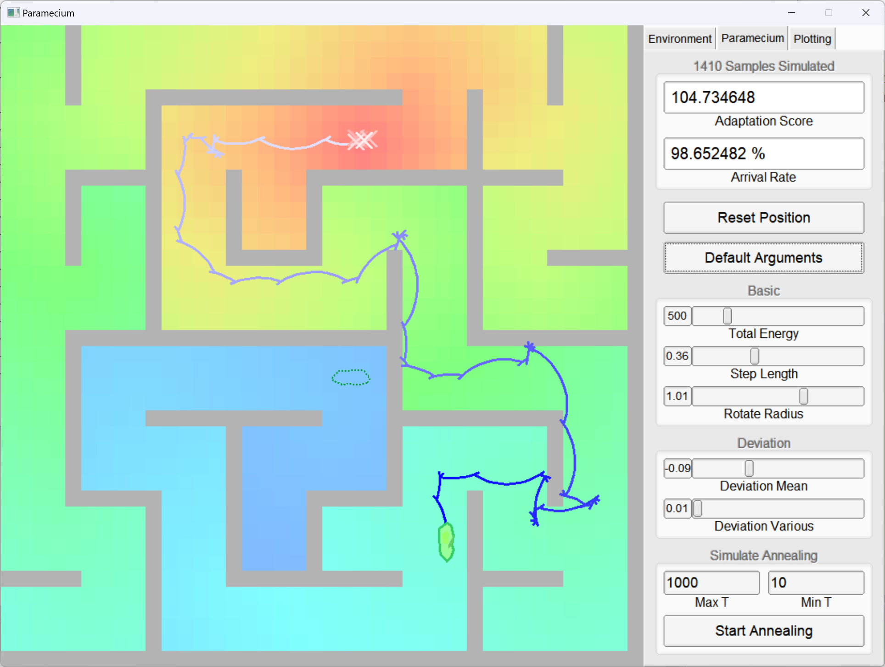
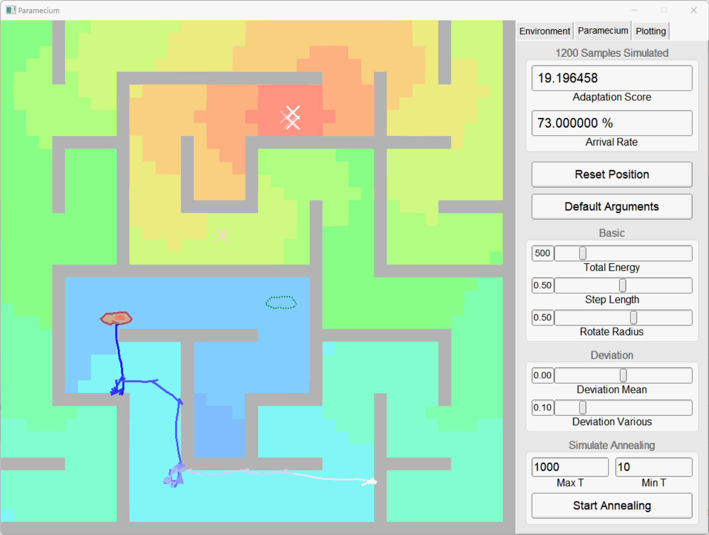

# fltk_Paramecium

> "生命总会找到自己的出路"

[简介](#简介) | [操作说明](#操作说明)

假如 - 只是假如, 你醒来时发现自己变成了一只草履虫, 在二维网格的世界中遨游. 那么, 赛博草履虫会梦见问题求解 Project2 吗?

既然这一切已经发生了, 至少从程序启动的那一刻起, 考试, 作业, 自我否定与精神内耗, 或者是宇宙的终极答案, 这些一切都不再重要. 作为一只单细胞生物, 你只需要转向, 前进, 不断接近终点处那团营养物质 - 那里有无限的富饶与宝藏.

那么, 出发吧!

## 简介

### 基本行为模式

一只草履虫的行为模式非常简单 - 毕竟它只是一个单细胞生物, 所依赖的只有周身摆动的纤毛.

依据真实的草履虫行为模式进行归纳和模拟后, 得到了程序中草履虫的基本模式: 它只有两种运动状态: **向前进**, 或者**回退并偏转方向**. 同时它所能获取到的信息也非常有限: 自身**是否接触到障碍物**, 以及自身所处位置**营养浓度的变化** (环境信息具体含义请参见 [自然环境](#自然环境模拟) 章节) .

上图简要描述了程序模拟的草履虫行为模式图. 由于在触碰到障碍物 / 营养浓度降低 时草履虫一般都能成功回退到上一次前进之前的状态, 之后转向并开始对于新的方向的尝试. 因此这种方式能够很大程度上保证一次 "成功" 的尝试 (即没有后续回退步骤) 都能使草履虫**前进到浓度相等或升高的新位置**.

长此以往, 在经过足够多次数的尝试 (以及一些运气) , 不断根据当前信息切换匹配的运动状态, 草履虫就可以用这样的行为模式在各种环境中**找到属于自己的出路**.

当然, 环境和每步的具体执行都会影响寻路结果的好坏. 具体内容将在 [参数和适应性](#参数和适应性) 章节讨论.

不过, 真实的草履虫事实上也不总是向同一方向转向, 对营养也没有如程序中展现的如此强烈的偏好... 但加上这些设定之后依然能获得较好的效果 (总得设定一个目标吧233)

### 自然环境模拟

本项目预期模拟的自然环境为**含有较稀疏障碍的静止水体**, 并采用**二维网格**进行呈现. 这符合自然界中草履虫的生境. 以下是名词含义与理论分析:

- **营养源 / Origin :** 可能是一块糖或者其它形式的营养物质, 是本程序中寻路的目标. 程序中营养源以网格为单位, 强度不会随时间变化, 也不会耗尽或者消失.

- **障碍物 / Barrier :** 同时阻挡草履虫的移动和营养的扩散, 且不会随时间变化.

在静止的水体中, 由于扩散与生物摄取的共同作用, 营养源会在水体中形成较为稳定的**浓度梯度**. 本程序通过计算**到营养源的最短距离**近似求解某个位置的营养浓度. 这种方法没有考虑障碍物疏密 / 阻力对于扩散速率及浓度的影响 (例如, 密集而狭窄的障碍应当很大程度阻止营养的扩散) , 但对于障碍物较稀疏的情况, 这种方式依然能快速而较准确地模拟出营养浓度的相对关系.

程序使用 **BFS** 算法以计算各格点到营养源的距离, 以减小计算量, 加快速度, 并处理多个营养源共存的情况. 之后通过算法映射为渐变色并展示, 越接近源点越偏红色. 障碍物会显示为灰色方格.

### 参数和适应性

**相同的行为模式下亦有千秋**. 通过细致调整各类参数, 你可以探索各种环境下不同生存策略对结果的影响. 下面介绍程序中各个参数的含义和效果, 以及比较生存策略优劣的方式.

**程序的可调整参数 :**

- **总能量 / Total Energy :** 一次模拟寻路允许消耗的总能量. 程序中草履虫的**各类行动都会消耗能量**, 若未能在能量耗尽前找到稳定的能量来源 (即能量源) , 草履虫的模拟生命就可能终止. 越复杂的环境, 越长的寻路里程, 就需要预先分配越充足的能量, 但也会略微减缓模拟速度. 允许调整的限定范围为 `(50,2500)` , 默认值 `500` .

- **步长 / Step Length :** 程序两次检测环境信息 (即每步) 之间的前进距离, 实际上反映了**获取环境信息的频率**. 以格为单位, 限定范围 `(0.01,1)` , 默认值 `0.5` . 更短的步长意味着更高频而精确地获取环境信息, 但同时也会消耗更多能量用于维持探测.

- **旋转角 / Rotation Radius :** 进行回退操作的同时旋转的角度. 旋转角大小 (以及方向) 对策略优劣的影响**与环境密切相关**. 但过大的旋转角往往会错过正确方向, 而过小的旋转角又大大降低了运动的灵活性. 单位为弧度, 限定范围 `(-pi,pi)`, 默认值 `0.5` .

- **偏移均值 / Deviation Mean :** 生物前进时产生的偏航角度, 这可能由于动力的推进方向与草履虫本身质心有偏离, 或者受到不对称阻力的影响而产生. 通常情况下生物会保持对称以尽可能走直线路径, 但在某些情况下, 存在偏移反而能提高寻路的速度并有效减少回退次数. 单位为弧度, 限定范围 `(-0.25,0.25)`, 默认值 `0` .

- **偏移方差 / Deviation Variance :** 每步产生的随机方向偏移. 这可能是由环境随机因素影响和扰动而产生. 通常生物会通过某些感受器和参照物使得前进方向尽可能精确, 因此改变该参数能直观感受这些努力的效果. 限定范围 `(0.01,0.5)`, 默认值 `0.1` .

**适应性和评价标准 :**

为了评价特定参数所对应的策略是否适合于给定环境, 程序引入了**适应性分数**这一评判标准. 更高的适应性分数通常意味着给定参数在该环境下是更好的行为策略, 进而, 在生物学上它们由于在本群体中更有优势并产生更多子代, 成为种群进化的可能方向, 如下图[^1]:

为了更好地反映行为模式的适应性水平, 适应性分数综合考虑了多种因素. 通常情况, 在能量耗尽**前到达营养源的比例越高, 越快 (即消耗较少能量) 到达营养源, 在能量耗尽时越接近营养源,** 适应性分数越高. 程序将会采集多次模拟的结果, 以平均值作为该策略的适应性分数.

在界面上, 程序会展示**适应性分数和到达率**两个指标, 以供参考. 需要强调的是, 生物的进化方向以及适应性是**相对于特定环境而言**的, 相同行为模式可能在不同环境下产生截然相反的效果, 不同环境通常也会产生不同的适应性策略. 因此适应性分数和到达率的比较应当在**相同环境下的不同参数, 或者相同参数在不同环境下的表现**才有意义.

## 操作说明

上图是程序运行时的界面示意. 窗口整体分为左侧的二维网格显示和右侧的参数调整两个主要区域. 右上角有三个选项卡, 具体功能如下: 

### "环境" / Environment

在 "环境" 模式下, 你可以**查看和编辑环境**. 功能与操作演示如下:

> 点击项目标题以展开 / 收起演示图片

 
 生成迷宫 

> 由于 Gif 图片格式问题, 颜色可能出现失真

- 生成随机的障碍与营养源

- 基本单元大小由用户指定

- 输入随机种子以按特定规律生成迷宫

 
 修改障碍物 / 营养源 

> 由于 Gif 图片格式问题, 颜色可能出现失真

- 点击 `"Switch to ..."` 切换编辑目标, 之后在网格区域使用鼠标操作进行编辑

- 点击 `"Clear ..."` 按钮清除场上的对应目标

- 目标为 "障碍物" 时, 第一次单击左键添加起始点, 然后在终止点处再次单击左键以创建连接两点的直线段障碍. 在确定起始点后单击右键取消添加线段, 其它时刻在障碍物上单击右键清除对应网格上的障碍物.

- 目标为 "营养源" 时, 在网格上单击左键添加营养源, 在营养源上单击右键可以清楚对应网格上的营养源.

### "草履虫" / Paramecium

在 "草履虫" 模式下, 你可以**查看草履虫的状态和修改草履虫的参数**.

> 点击项目标题以展开 / 收起演示图片

 
 查看路径和设定位置 

> 由于 Gif 图片格式问题, 颜色可能出现失真

- 程序会按照参数自动开始模拟

- "当前路径" 将会以蓝色线条展示. 通过当前路径可以观察基本的行为模式, 帮助分析可能的优化方式. 当前路径的模拟不受总能量限制, 也不会计入适应性得分

- "分数模拟" 的结果会呈现在参数区右上角, 包括已模拟的数量, 平均适应性分数和到达率数据. 同时程序会选取一部分结果的终止点 (即到达源点或能量耗尽的位置) 在网格上生成红色叉状指示器, 以展示能量消耗状态及到终点的剩余距离

- 任何时候, 在网格区域单击左键进入位置选择状态, 之后在新的位置再次单击以设定起点. 之后模拟会自动重启

 
 修改参数 

> 由于 Gif 图片格式问题, 颜色可能出现失真

- 通过拖动参数区的滑动条修改对应参数, 具体含义参见 [参数和适应性](#参数和适应性) 章节. 修改参数后将自动按照新的参数进行模拟.

### "图表" / Plotting

在 "图表" 模式下, 你可以**直观对比参数对适应性的影响, 以此调整和优化**:

> 点击项目标题以展开 / 收起演示图片

 
 生成图表和查看数据 

> 由于 Gif 图片格式问题, 颜色可能出现失真

- 首次点击 "图表" 选项卡, 或点击 `"Confirm Arguments"` 开始生成图表. 由于需要模拟大量数据, 生成速度可能较为缓慢, 还请坐和放宽.

- 图表展示了两个参数在一定范围内的数值组合对应的适应性分数及其它模拟结果. 参数值和范围可以在参数区的坐标轴上确认

- 生成完毕后, 鼠标移动至网格上可以查看对应的参数和结果. 该网格将会高亮显示, 同时根据在图上的位置在合适方向绘制悬浮窗

- 可以减小每格采样数以加快模拟速度

 
 修改绘图参数 

- 通过滑动条:

- 通过在网格上点击和在输入框内输入:

> 由于 Gif 图片格式问题, 颜色可能出现失真

- 可以通过滑动条和输入框, 或者点击对应格点设定参数及范围. 结果将在坐标轴上实时显示. 详见演示图片

 
 修改坐标轴变量 

> 由于 Gif 图片格式问题, 颜色可能出现失真

- 通过在下拉框中选择以修改对应坐标轴的变量. 两坐标轴的变量不能相同

 
 查看参数对应的模拟 

> 由于 Gif 图片格式问题, 颜色可能出现失真

- 在图表的特定网格上点击, 设定参数后, 返回 "草履虫" 选项卡, 即可查看对应参数的模拟结果. 之后可以回到图表模式再次修改参数和范围

[^1]: [Adaptation - Wikipedia](https://en.wikipedia.org/wiki/Adaptation)